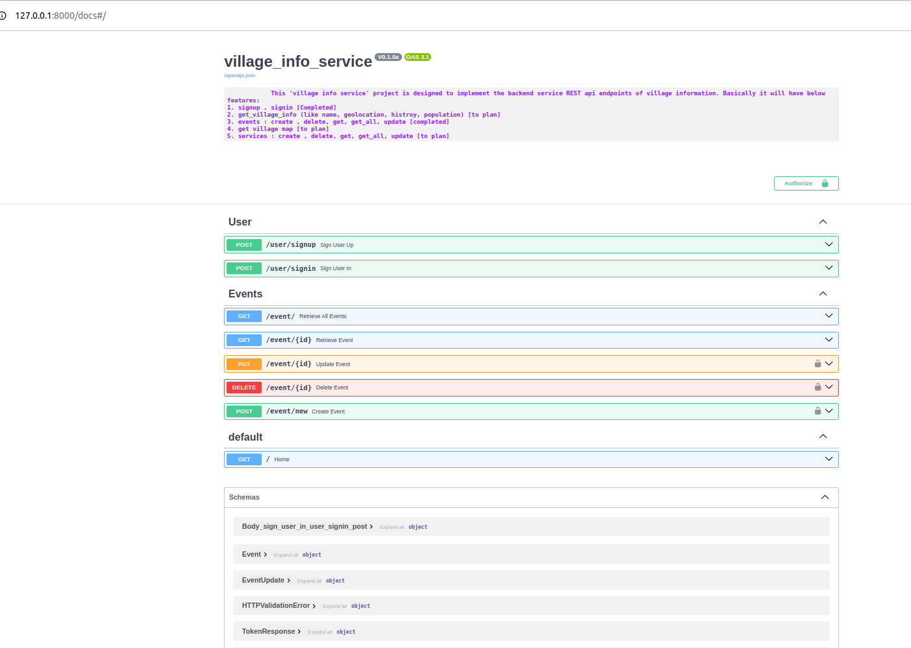

## Project : village_info_service
This 'village info service' project is designed to implement the backend service REST api endpoints
of village information. Basically it will have below features:

    1. signup , signin [Completed]
    2. get_village_info (like name, geolocation, histroy, population) [to plan]
    3. events : create , delete, get, get_all, update [completed]
    4. get village map [to plan]
    5. services : create , delete, get, get_all, update [to plan]

## How I created this project?
poetry new village_info_service # create project

poetry add fastapi uvicorn  # add dependencies

add project structure : files and modules

## How to Run?
poetry run uvicorn main:app --reload
or
python main.py (if main.py already has logic to run uvicorn)

## MongoDB
install MongoDB from official website on ubuntu :
    https://www.mongodb.com/docs/manual/tutorial/install-mongodb-on-ubuntu/

start and check mongodb status :
    sudo systemctl start mongod

Use MongoDB Compass tool to view and play with DB records 

## Output?
    http://127.0.0.1:8000/
    http://127.0.0.1:8000/docs
    http://127.0.0.1:8000/redoc

